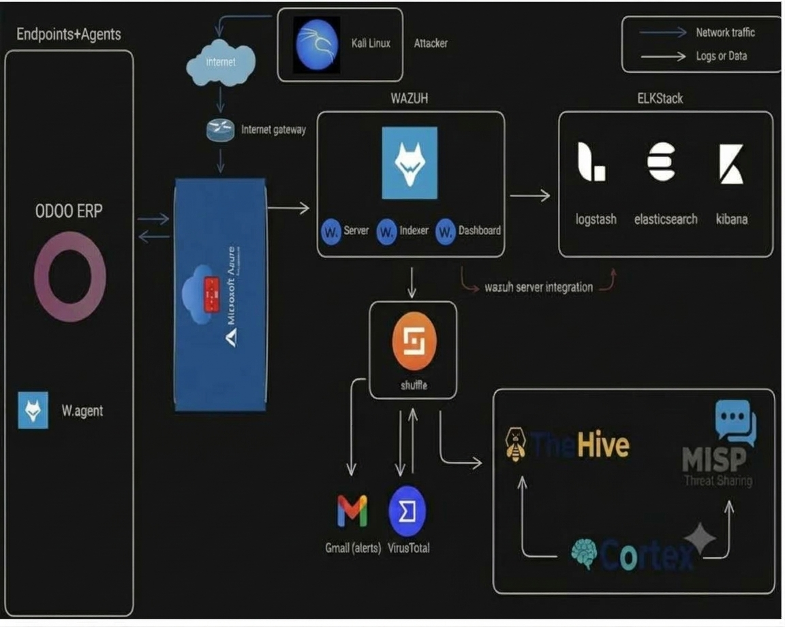

# SOC pour la Détection et la Réponse aux Menaces sur les ERP 

## 📌 Contexte
Ce projet a été réalisé dans le cadre d'un Projet de Fin d'Études (PFE) au sein de **GM-Soft** (Béni Mellal, Maroc), en collaboration avec l'**École Supérieure de Technologie de Béni Mellal (ESTBM)**.

**Réalisé par :**
- Intissar FARHOUN
- Mohammed KHALISS

**Encadrement :**
- **Encadrant industriel :** Mlle. Chaimae LAMACHI (GM-Soft)
- **Encadrant académique :** Pr. Siham BAKKOURI (ESTBM)

## ⚠️ Avertissement de confidentialité et propriété intellectuelle
Le code source complet, les configurations spécifiques et les données de production sont la **propriété exclusive de GM-Soft**. 
En raison de la confidentialité des données et pour protéger la propriété intellectuelle de l'entreprise, seuls les **scripts génériques nettoyés**, la **documentation** et l'**architecture** sont publiés ici. 
Aucune donnée sensible (clés API, adresses IP internes, identifiants, logs réels) n'est incluse dans ce dépôt.

## 🎯 Objectifs du projet
Concevoir et déployer un prototype de Security Operations Center (SOC) capable de :
- Centraliser les logs (SIEM).
- Détecter les menaces via des règles de corrélation et de l'apprentissage non supervisé (Anomaly Detection OpenSearch plugin).
- Automatiser la réponse aux incidents (SOAR).
- Générer des rapports d'analyse via un LLM (Groq API / LLaMA 3.3).

## 🏗️ Architecture

  
   
  <em>Figure 1 — Architecture du système de détection</em>
   
  👉 Cliquez sur le schéma pour comprendre le <strong>flux de données</strong> en détail

L'architecture repose sur une approche **Defense-in-Depth** :
...
1. **Périmètre (Cloud Azure) :** Le filtrage et le blocage des IP malveillantes sont assurés par le **pare-feu natif Microsoft Azure (Network Security Group / Azure Firewall)**. Il n'y a pas d'IDS/IPS local (type Snort/Suricata) dans cette version.
2. **Collecte & Analyse (SIEM) :** Wazuh Manager, Indexer et Dashboard.
3. **Stockage & Rétention :** Stack ELK (Elasticsearch, Logstash, Kibana).
4. **Détection IA :** Plugin OpenSearch Anomaly Detection (détection non supervisée de déviations).
5. **Orchestration (SOAR) :** Shuffle (automatisation des playbooks).
6. **Threat Intelligence :** MISP + VirusTotal API.
7. **Gestion des incidents :** TheHive + Cortex.
8. **Génération de rapports :** API Groq (LLaMA 3.3 70B) pour la synthèse automatique.

## 💻 Contraintes techniques du prototype
En raison de contraintes de ressources, le prototype a été déployé sur **une seule machine virtuelle Azure** :
- **RAM :** 16 Go
- **Disque :** 256 Go
- **Déploiement :** Conteneurs Docker (Shuffle, Cortex, TheHive, ELK, ERP Odoo + agent).

**Note pour la production :** Pour un déploiement à grande échelle chez GM-Soft, cette architecture sera migrée vers des ressources dédiées (ou un cluster Kubernetes/AKS) afin de garantir la haute disponibilité et les performances nécessaires à la surveillance des solutions ERP de l'entreprise.

## 🚀 Fonctionnalités clés
- **Détection automatisée :** Règles Wazuh personnalisées (MITRE ATT&CK) + Détection d'anomalies par Machine Learning (Anomaly Detection OpenSearch plugin).
- **Réponse automatisée :** Playbooks Shuffle pour le blocage d'IP via l'API Azure et l'enrichissement VirusTotal.
- **Rapports intelligents :** Génération quotidienne de rapports PDF via LLM (Groq) avec classification des menaces et recommandations.
- **MTTD < 3s et MTTR < 5s** (Mesuré sur le prototype).

## 📂 Contenu du dépôt
- `docs/` : Rapport PFE (version publique nettoyée), guide de déploiement, schémas.
- `scripts/` : Scripts Python génériques (MISP-to-Wazuh, OpenSearch Anomaly, LLM Report).
- `config/` : Règles Wazuh XML, workflow Shuffle (JSON).
- `docker/` : Fichier `docker-compose.yml` simplifié pour le POC.

## 🙏 Remerciements
En reconnaissance des communautés open source et de leur contribution à la concrétisation de ce projet, nous avons décidé de rendre publiques notre documentation ainsi que les étapes suivies pour le réaliser. Nous remercions particulièrement les équipes de Wazuh, Elastic, Shuffle, TheHive, Cortex, MISP et OpenSearch.
